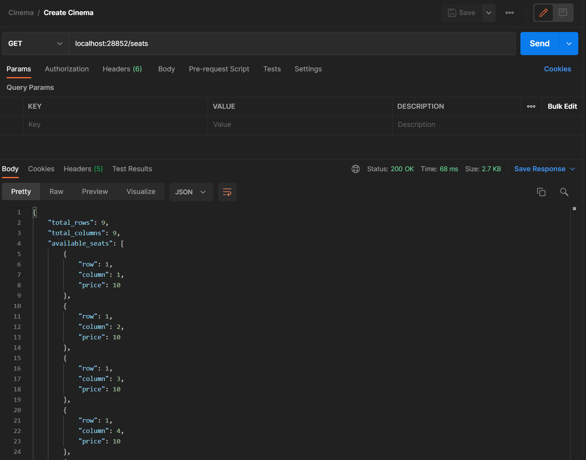
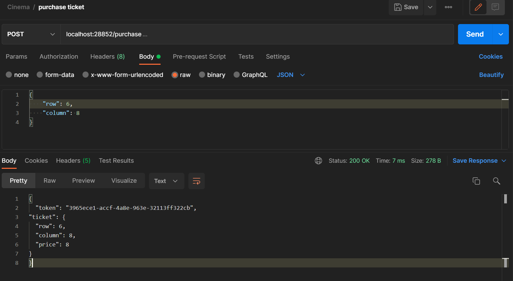
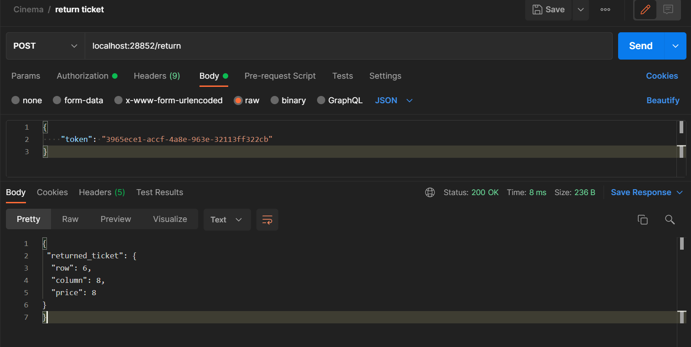

# Web_Quiz_Engine_REST
Restful Api cinema room - JetBrains Academy Project.

## About
Spring REST service that manage a small movie theatre. Handle HTTP requests in controllers, create services and respond with JSON objects. Calculate price of tickets(depends of row/column). Purchase, return ticket. Stats of total purchased tickets.

## Tech
- Java
- Spring Framework
- Spring Security

## Illustrations

### Create Cinema

### Purchase ticket

### Return ticket

